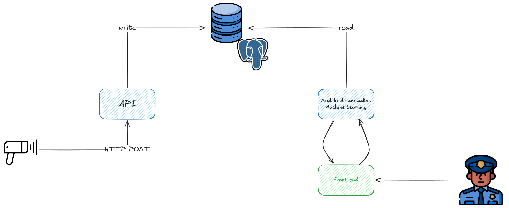

# Projeto Final Fase 3: Radar Inteligente e Análise Preditiva

Este projeto integra três componentes principais para monitoramento, registro e análise preditiva de medições de radar de veículos:

- **API de Medições de Radar** (`api/`)
- **Programa de Carga de Dados** (`carga-banco/`)
- **Modelo de Análise Preditiva com Interface Gráfica** (`model/`)

Cada componente possui seu próprio README detalhado. Abaixo, um resumo geral e referências para documentação específica.

## Arquitetura do projeto



Os radares espalhados pelo estado do Rio de Janeiro enviam dados para a API, que armazena as medições em um banco de dados PostgreSQL. O modelo de análise preditiva lê os dados do banco, identifica possíveis clonagens de placas e apresenta os resultados em uma interface gráfica interativa, atendendo assim ao usuário final.

---

## 1. API de Medições de Radar

API desenvolvida em FastAPI para registro e consulta de medições de velocidade de veículos. Permite integração com banco de dados relacional e oferece endpoints para inserção e consulta dos dados.

- Documentação completa: [`api/README.md`](api/README.md)

Principais tópicos:
- Registro de medições via POST
- Consulta de medições
- Configuração de variáveis de ambiente
- Exemplo de chamada via `curl`

---

## 2. Programa de Carga de Dados

Script Python que lê um arquivo CSV com medições e envia os dados para a API via requisições HTTP POST. Automatiza o processo de alimentação do banco de dados da API. Simula o processo de envio de dados por múltiplos radares.

- Documentação completa: [`carga-banco/README.md`](carga-banco/README.md)

Principais tópicos:
- Execução do script de carga
- Dependências necessárias
- Estrutura do arquivo CSV

---

## 3. Modelo de Análise Preditiva e Interface Gráfica

Aplicação Streamlit que realiza análise preditiva para detecção de possíveis clonagens de placas de veículos, utilizando técnicas de machine learning (Isolation Forest). Os resultados são apresentados em mapas e tabelas interativas.

- Documentação completa: [`model/README.md`](model/README.md)

Principais tópicos:
- Execução da interface gráfica
- Configuração do banco de dados
- Dependências de machine learning e visualização

---

## Requisitos Gerais
- Python 3.11
- Banco de dados PostgreSQL (para API e modelo)

Consulte os READMEs de cada componente para detalhes de instalação, configuração e uso.

---

## Estrutura do Projeto
```
api/           # API de medições de radar
carga-banco/   # Script de carga de dados
model/         # Análise preditiva e interface gráfica
README.md      # Documentação geral do projeto
```

---

## Referências
- [`api/README.md`](api/README.md)
- [`carga-banco/README.md`](carga-banco/README.md)
- [`model/README.md`](model/README.md)
